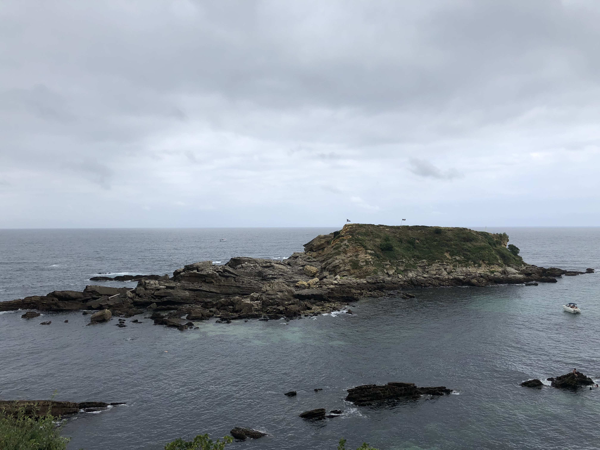

I am an Associate Professor of Political Science in the [Department of Social Sciences](https://www.uc3m.es/social-sciences-department/home) at [Universidad Carlos III de Madrid](https://www.uc3m.es/home) and a fellow member of the [Instituto Juan Linz](https://ijlinz.es). Starting in September, I will be joining the [*Regional and Federal Studies*](https://www.tandfonline.com/journals/frfs20) Editorial Team! 

My research focuses on federalism and decentralization. I use a range of quantitative methods to examine how these institutions are designed, how they evolve over time, and how they shape multilevel politics and societies. Part of my research has been published at the *European Journal of Political Research*, *Regional Studies*, and *West European Politics*, among others.

I obtained my PhD from [Binghamton University](https://www.binghamton.edu/). Prior to joining UC3M, I was a Max Weber postdoctoral fellow at the [European University Institute](https://www.eui.eu/en/home), where I have also being a visiting fellow.

Below, my namesake... [Amuitz Island](https://www.google.es/maps/place/Isla+de+Amuitz/@43.3950778,-1.7944287,17z/data=!3m1!4b1!4m6!3m5!1s0xd510bd24456c9c5:0xb122e06ffa8966a4!8m2!3d43.3950778!4d-1.7918538!16s%2Fg%2F11nywkj76c?entry=ttu&g_ep=EgoyMDI2MDQyOS4wIKXMDSoASAFQAw%3D%3D), in Hondarribia.

