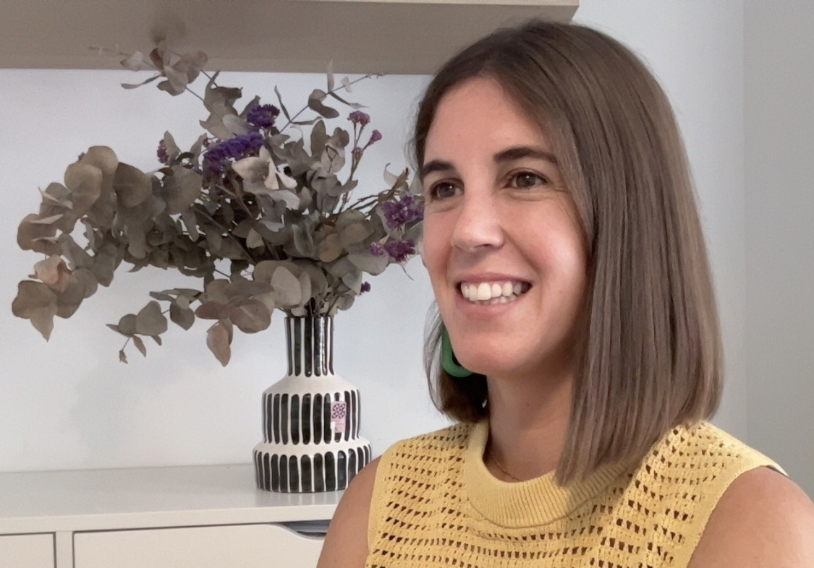

I am an Associate Professor of Political Science in the [Department of Social Sciences](https://www.uc3m.es/social-sciences-department/home) at [Universidad Carlos III de Madrid](https://www.uc3m.es/home) and a fellow member of the [Instituto Juan Linz](https://ijlinz.es). Starting in September, I will be joining the *Regional and Federal Studies* Editorial Team! 

My research

I obtained my PhD from [Binghamton University](https://www.binghamton.edu/). Prior to joining UC3M, I was a Max Weber postdoctoral fellow at the [European University Institute](https://www.eui.eu/en/home), where I have also been a visiting fellow.
