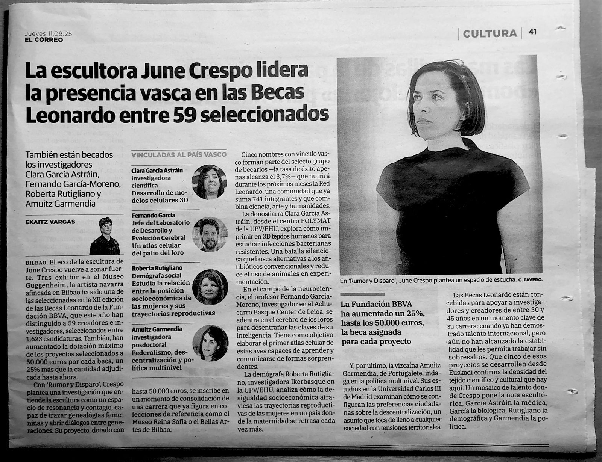

## Media

### Press

<article class="media-item">
  
  

    
El Correo · 11 September 2025 · Cultura

    
La escultora June Crespo lidera la presencia vasca en las Becas Leonardo entre 59 seleccionados

    
El Correo covers the 59 researchers and creators selected for the 2025 Leonardo Grants of the Fundación BBVA, highlighting the five with Basque ties. Among them is Amuitz Garmendia, recognised for DRIFT, her UC3M project on how citizens' preferences over decentralization take shape.

    
<a href="./files/elcorreo-2025-09-11.jpg" target="_blank" rel="noopener"><button type="button">Read article</button></a> <a href="./rp/drift.html"><button type="button">DRIFT project</button></a>

  

</article>

