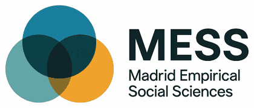
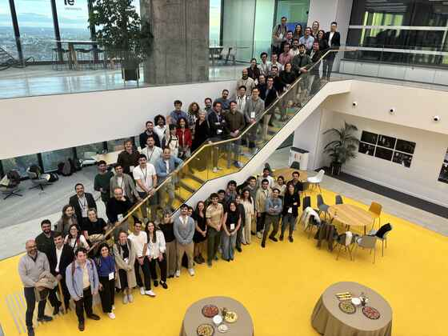

<a href="./misc.html">Miscellaneous</a>

## Madrid Empirical Social Sciences (MESS)

MESS (Madrid Empirical Social Sciences) is a collaborative network founded by a group of young social scientists based in Madrid. It brings together empirical researchers at all career stages working in political science, sociology, economics and the wider social sciences across the Madrid region. MESS aims to make the most of the region's rich scientific ecosystem, whose scholars and institutions too often work alongside one another without meeting. It does so by creating regular opportunities to exchange ideas, share ongoing work and build collaborations across institutional boundaries. The network now counts more than 120 members from Universidad Carlos III de Madrid, IE University, CSIC, Universidad Complutense, CUNEF Universidad and Universidad Autónoma de Madrid.

What we do:

- An annual workshop where members present research projects and exchange ideas.
- Regular get-togethers to build networks between colleagues from different institutions.

<h3 style="font:500 21px/1.3 var(--serif);text-transform:none;letter-spacing:0;color:var(--ink);margin:1.6em 0 .4em;">MESS I: UC3M</h3>

Date: October 18–19, 2024 
Location: <a href="https://maps.app.goo.gl/JDHx4d3A1kpN7fNg8" target="_blank" rel="noopener">UC3M Puerta de Toledo Campus, Madrid</a> 
Keynote speaker: <a href="http://www.niloufersiddiqui.com/" target="_blank" rel="noopener">Professor Niloufer A. Siddiqui (SUNY Albany)</a>

<h3 style="font:500 21px/1.3 var(--serif);text-transform:none;letter-spacing:0;color:var(--ink);margin:1.6em 0 .4em;">MESS II: IE University</h3>

Date: October 24–25, 2025 
Location: <a href="https://www.google.com/maps/search/?api=1&query=IE+Tower+Paseo+de+la+Castellana+259+Madrid" target="_blank" rel="noopener">IE Tower, P.º de la Castellana, 259, Madrid</a> 
Keynote speaker: <a href="https://www.turnbulldugarte.com/" target="_blank" rel="noopener">Stuart J. Turnbull-Dugarte (University of Southampton)</a>

<figure style="max-width:560px;margin:1em 0 1.6em;">
  
  <figcaption style="font-size:14px;color:var(--muted);margin-top:8px;">MESS II participants at IE Tower, Madrid</figcaption>
</figure>

I'm part of the scientific committee, together with Emmy Lindstam (IE University), Amalia Álvarez-Benjumea (CSIC), Jorge M. Fernandes (CSIC), Patrick Kraft (CSIC) and Sergio Galaz-García (CUNEF).

<a href="https://madridempiricalsocialsciences.github.io/" target="_blank" rel="noopener"><button type="button">Visit the MESS website</button></a>

