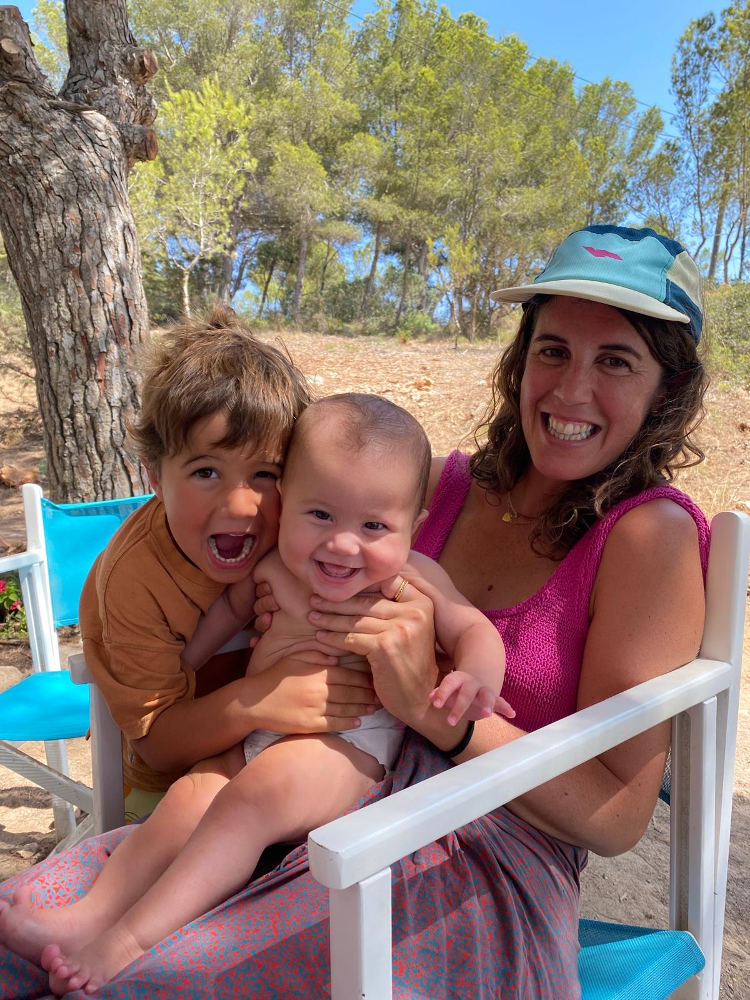

## Miscellaneous

<figure style="width:260px;max-width:100%;margin:0;">
  
Proud mom of 2 BeBe's

  
  <figcaption style="font-size:14px;color:var(--muted);margin-top:8px;">With Begoña and Bernat</figcaption>
</figure>

<figure style="width:260px;max-width:100%;margin:0;">
  
<a href="./mess.html">Responsible of the MESS 😉</a>

  
  <figcaption style="font-size:14px;color:var(--muted);margin-top:8px;">Madrid Empirical Social Sciences</figcaption>
</figure>

