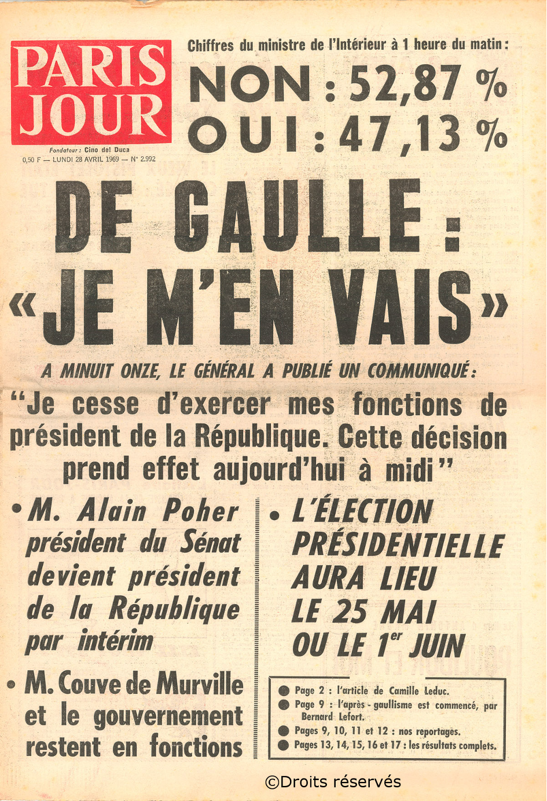
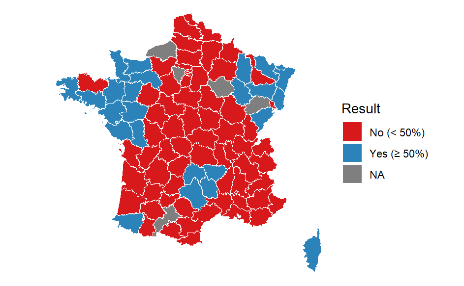

<header class="project-head">
  
Beca Leonardo · Fundación BBVA · 2025–2027

  <h2 class="project-title">DRIFT</h2>
  
Decentralization, Reforms, Institutions, and the Formation of Territorial Preferences

  

    <a href="https://www.redleonardo.es/beneficiario/amuitz-garmendia-madariaga/" target="_blank" rel="noopener"><button type="button">Beca Leonardo</button></a>
    <a href="../research.html"><button type="button">All research</button></a>
  

</header>

  <h3 class="project-h">Why it matters</h3>
  
Over the last half century, decentralization reforms have reshaped how power is shared in most democracies. Yet what we know about citizens' <em>territorial preferences</em> — their views on how authority should be divided between central and regional governments — comes mostly from places with strong centre–periphery conflicts, such as Scotland, Catalonia or Flanders, and from surveys that capture those views at a single point in time.

  
DRIFT looks at how these preferences are formed, and at when they stay put and when they change, across very different institutional and social settings.

  <h3 class="project-h">Three goals</h3>
  <ol class="project-steps">
    <li><strong>A theory of territorial preferences.</strong> Map the economic, political and cultural forces behind the full range of views, from centralizers to decentralizers — including those content with the status quo.</li>
    <li><strong>A comparative survey with experiments.</strong> Combine public-opinion research with survey experiments to separate the identity, ideological and material roots of these preferences.</li>
    <li><strong>History as evidence.</strong> Build a new dataset of canton-level results from the 1969 French regionalization referendum — never used before — to study territorial preferences through real votes, in one of Europe's most centralized states.</li>
  </ol>

  <h3 class="project-h">Featured paper</h3>
  

    
Decentralization by Design, Democracy by Default: De Gaulle's 1969 Gambit

    
with Filippo Liviano D'Arcangelo (PhD student, UC3M) · work in progress

    
France is the textbook case of a centralized state, where the centre–periphery conflict is assumed to have faded long ago. The 1969 referendum puts that assumption to the test. De Gaulle bundled the creation of regions with a vote of confidence in himself, forcing voters to weigh their territorial preferences against their support for the President.

    
Using canton-level results (N = 4,302) linked to the Converse panel survey of French voters, and extending Graham and Svolik (2020) with a regionalist dimension, the paper shows how the centre–periphery divide shaped the vote even in one of Europe's most centralized countries.

    
<a href="../research.html#working-papers"><button type="button">Working papers</button></a>

  

  
On 27 April 1969, French voters rejected the reform and de Gaulle resigned the next day. As the map shows, the result was far from uniform: parts of the west, the east, the Massif Central and Corsica voted Yes, while most of the country said No.

<aside class="project-figs">
  <figure>
    
    <figcaption><b>The morning after.</b> <em>Paris Jour</em>, 28 April 1969: “De Gaulle: I'm leaving.”</figcaption>
  </figure>
  <figure>
    
    <figcaption><b>A divided map.</b> 1969 referendum results by département: Yes ≥ 50% in blue, No in red, missing data in grey.</figcaption>
  </figure>
</aside>

