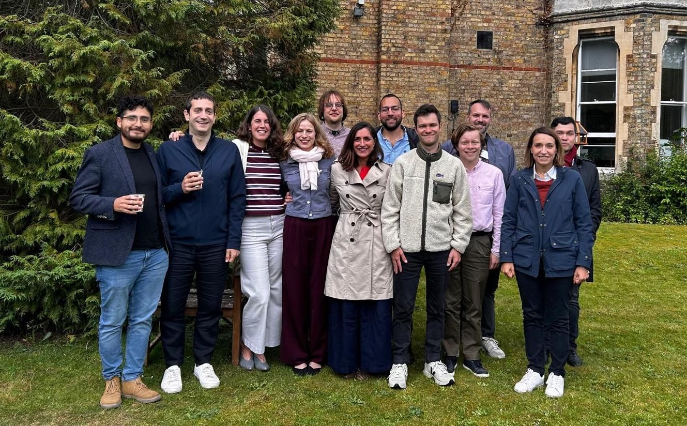

<header class="project-head">
  
Ministerio de Ciencia e Innovación · PID2021-128287NB-I00 · 2022–2026

  <h2 class="project-title">FEDCRISIS</h2>
  
Federalism against its challenges: crisis, polarization and populism

  

    <a href="../research.html"><button type="button">All research</button></a>
  

</header>

  <h3 class="project-h">Why it matters</h3>
  
Federalism and decentralization are usually sold as a package deal: better governance, sharper accountability, calmer ethnic and territorial conflict. But that promise has rarely been tested under real pressure. FEDCRISIS asks what happens to multilevel democracies when the pressure is on — when a pandemic hits, when politics turns tribal, and when populists start using the map itself as a weapon.

  
Co-led with Sandra León and funded by Spain's Ministry of Science and Innovation, the project tracks how crisis, polarization and populism strain the relationship between central and regional governments — and what citizens make of it.

  <h3 class="project-h">Three challenges</h3>
  <ol class="project-steps">
    <li><strong>Crisis.</strong> The COVID-19 pandemic turned decentralization into a daily headline. We study how citizens' support for (de)centralized power shifted as the crisis unfolded, and what that shift reveals about the durability of territorial preferences under stress.</li>
    <li><strong>Polarization.</strong> Affective polarization doesn't stop at the national level. We examine how it seeps into multilevel politics and undermines the accountability mechanisms that federal and decentralized systems depend on.</li>
    <li><strong>Populism.</strong> Radical right-wing parties have found a new use for the centre–periphery cleavage. We trace how their discourse instrumentalizes territorial identity and what it means for the politics of decentralization going forward.</li>
  </ol>

  <h3 class="project-h">Data</h3>
  
The project builds on three main datasets, used or created within FEDCRISIS:

  <ol class="project-steps">
    <li><strong>COVID-19 dataset (13 countries).</strong> Data collected during the pandemic in thirteen countries, used to study how territorial preferences and support for (de)centralization responded to the crisis. <em>Used in:</em> <a href="../pubs/ejpr2026.html"><em>European Journal of Political Research</em> (2026)</a> and <a href="../pubs/sesp2026.html"><em>South European Society and Politics</em> (2026)</a>.</li>
    <li><strong>DANA panel.</strong> A panel survey around the October 2024 Valencia floods, following the same people over time to see how a disaster shapes views on who should govern and who is to blame across levels of government. <em>Used in:</em> "Borders Within" and a new working paper with Sandra León, "From Shock to Disengagement: How Natural Disasters Reshape Politics in Low-Trust Democracies."</li>
    <li><strong>Comparative survey (6 countries).</strong> Belgium, Germany, Italy, Spain, the United Kingdom and the United States, with about 2,000–2,500 respondents per country. <em>Currently ongoing work.</em></li>
  </ol>

  <h3 class="project-h">Key publications</h3>
  

    
Crisis management and territorial preferences: Experimental evidence during the pandemic

    
with Sandra León · <em>European Journal of Political Research</em>, 2026

    
<a href="../pubs/ejpr2026.html"><button type="button">Details</button></a>

  

  

    
Crisis and centralisation: how the pandemic reshaped territorial preferences in Spain

    
with Sandra León · <em>South European Society and Politics</em>, 2026

    
<a href="../pubs/sesp2026.html"><button type="button">Details</button></a>

  

  

    
Territorial Polarisation after Radical Parties' Breakthrough in Spain

    
with Pedro Riera · <em>South European Society and Politics</em>, 2022

    
<a href="../pubs/sesp2022.html"><button type="button">Details</button></a>

  

  <h3 class="project-h">End-of-project conference</h3>
  
FEDCRISIS closed with two days at the European Studies Centre, St Antony's College, University of Oxford, where Sandra León and I hosted the workshop "Place-Based Identities and Polarization." Scholars working across political geography, regional politics, political behavior and social psychology came together around one question: how does where we come from shape how we feel about each other — and how consequential is that for behavior?

  
It was also where we made the public case for Territorial Affective Polarization (TAP) as its own research agenda, alongside talks on the territoriality of global cleavages, place-based misperceptions, regional identity and partisan affective polarization, decentralization and social spending, and partisan discrimination across seven countries.

  
<a href="https://www.linkedin.com/feed/update/urn:li:activity:7470516217531793410/" target="_blank" rel="noopener"><button type="button">Workshop recap</button></a>

  <h3 class="project-h">What's next</h3>
  
We are now working on the data from the comparative survey we developed in six federations and quasi-federations: Belgium, Germany, Italy, Spain, the United Kingdom and the United States. The survey lets us compare how territorial identities and affective polarization play out across very different multilevel systems.

<aside class="project-figs">
  <figure>
    
    <figcaption><b>End-of-project conference.</b> Participants at "Place-Based Identities and Polarization," European Studies Centre, St Antony's College, University of Oxford.</figcaption>
  </figure>
  

    
Related working papers

    
<strong style="display:block;color:var(--ink);margin-bottom:2px;">Territorial prejudice reduction through reciprocity</strong>with Sandra León

    
<strong style="display:block;color:var(--ink);margin-bottom:2px;">Territorial Identity in Comparative Perspective</strong>with Sandra León and Jair Alva Mendoza

    
<strong style="display:block;color:var(--ink);margin-bottom:2px;">Territorial Affective Polarization: Concept, Prevalence, and Impact</strong>with Sandra León

    
<strong style="display:block;color:var(--ink);margin-bottom:2px;">From Shock to Disengagement: How Natural Disasters Reshape Politics in Low-Trust Democracies</strong>with Sandra León

    
<a href="../research.html#working-papers"><button type="button">Working papers</button></a>

  

</aside>

